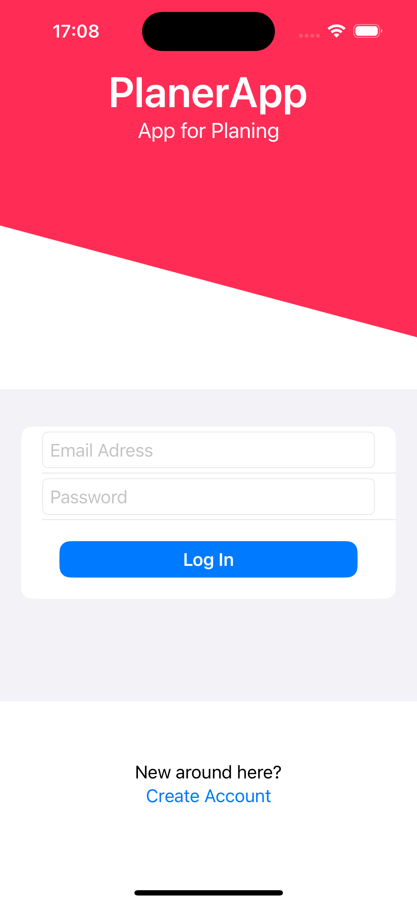
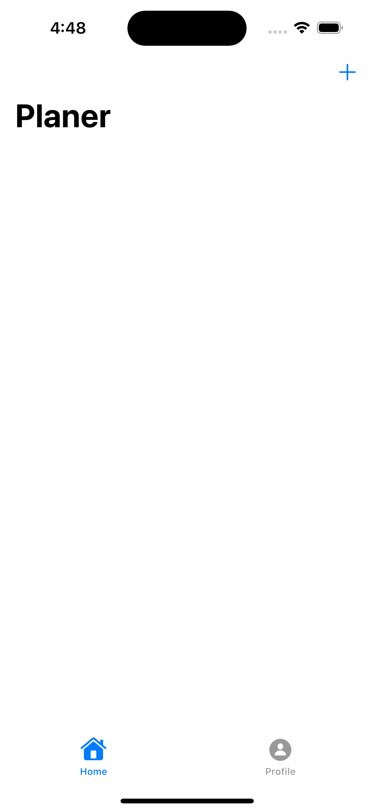

# Todo-List App (iOS)

## Overview

This Todo-List app is my first project developed using Swift. It served as a fantastic learning experience, allowing me to grasp most of the basics of Swift programming. The app is designed to help users manage their daily tasks efficiently by creating, updating, and deleting todos.

## Features

- **Task Management:** Create, update, and delete tasks with ease.
- **Firebase Integration:** The app uses Firebase to store todos. (Please note that I don't longer maintain it.)

## Learning Experience

This project was instrumental in my journey of learning Swift. I followed a YouTube tutorial ([Build To Do List App](https://youtu.be/t_mypMqSXNw?si=d9_nWXVETJeKn8ca)) that guided me through the process and became comfortable with basic Swift concepts, Firebase integration, and app development for iOS.

## Discontinuation

As this was a learning project, it is no longer actively maintained. However, the knowledge gained through this experience has laid the groundwork for future iOS projects.

---

## Screenshots

  
  

